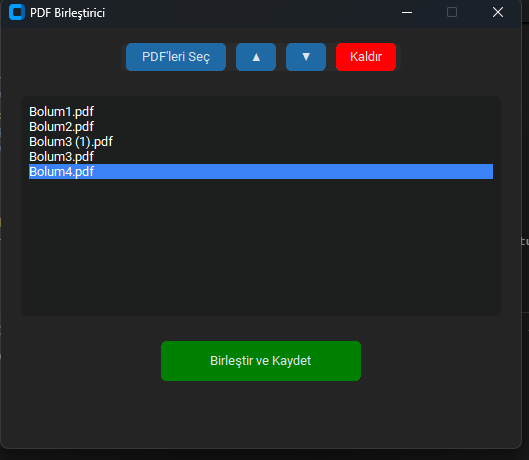

# PDF Birleştirici Uygulaması

## Genel Bakış

**PDF Birleştirici**, birden fazla PDF dosyasını kolayca birleştirmeni sağlayan, Python ile geliştirilmiş modern ve kullanıcı dostu bir masaüstü uygulamasıdır. Dosyaları seç, sırala, kaldır ve tek bir PDF olarak kaydet – hepsi basit bir arayüzle!

---

## Özellikler

- **Kolay PDF Seçimi:** Birden fazla PDF dosyasını aynı anda seçebilirsin.
- **Sürükle ve Sırala:** PDF dosyalarının sırasını yukarı/aşağı taşıyabilirsin.
- **Kaldırma:** Listeden PDF dosyalarını kolayca çıkarabilirsin.
- **Tek Tıkla Birleştirme:** Seçilen PDF'leri tek bir dosyada birleştirip kaydedebilirsin.
- **Modern Arayüz:** CustomTkinter ile şık ve kullanıcı dostu tasarım.

---

## Dosya ve Dizin Yapısı

```
.
├── main.py                # Uygulamanın giriş noktası
├── core/
│   ├── pdf_operations.py  # PDF işlemlerinin (ekle, çıkar, sırala, birleştir) mantığı
│   └── __init__.py        # (Boş, modül tanımlayıcı)
├── gui/
│   ├── main_window.py     # Ana pencere ve arayüz mantığı
│   └── __pycache__/       # (Otomatik oluşturulan derleme dosyaları)
└── README.md              # Proje dokümantasyonu (bu dosya)
```

### Modülerlik
- **core/**: PDF dosyalarıyla ilgili tüm iş mantığı burada. `PDFOperations` sınıfı ile dosya ekleme, çıkarma, sıralama ve birleştirme işlemleri yapılır.
- **gui/**: Kullanıcı arayüzü ve etkileşimler burada. `MainWindow` sınıfı, arayüzün tüm bileşenlerini ve olaylarını yönetir.
- **main.py**: Sadece uygulamayı başlatır ve arayüzü ekrana getirir. Tüm iş mantığı ve arayüz ayrı modüllerde tutulur.

Bu yapı sayesinde, arayüz ve iş mantığı birbirinden ayrılmıştır. Böylece kodun bakımı, test edilmesi ve geliştirilmesi kolaylaşır.

---

## Kurulum

1. **Gereksinimleri yükle:**
   ```bash
   pip install PyPDF2 customtkinter
   ```
2. **Uygulamayı başlat:**
   ```bash
   python main.py
   ```

---

## Kullanım

1. "PDF'leri Seç" butonuyla birleştirmek istediğin dosyaları seç.
2. Sıralamayı değiştir (yukarı/aşağı oklarıyla) veya dosya çıkar.
3. "Birleştir ve Kaydet" ile çıktı dosyasını kaydet.
4. İşlem tamam!

---

## Kullanılan Teknolojiler
- **Python 3**
- **PyPDF2**: PDF dosyalarını birleştirmek için.
- **CustomTkinter**: Modern ve özelleştirilebilir arayüz için.
- **Tkinter**: Dosya seçme ve mesaj kutuları için.

---

## Katkı Sağlama
Katkılar memnuniyetle karşılanır! Lütfen bir pull request açmadan önce bir issue oluştur.

---


## Ekran Görüntüsü (Opsiyonel)


---

